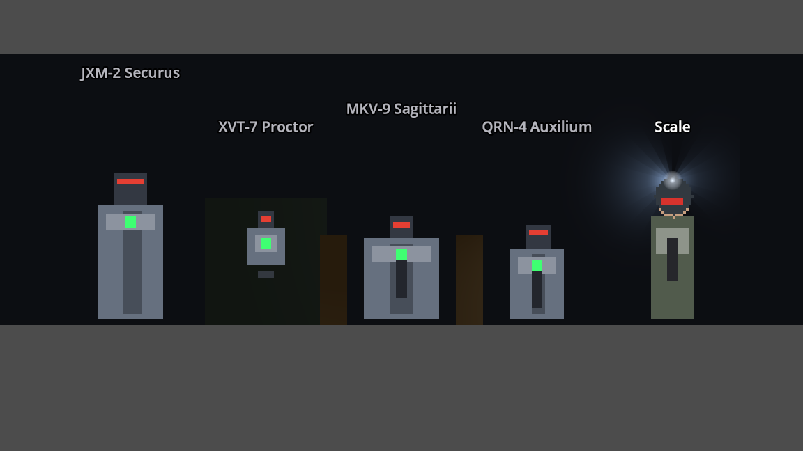

# Retake the Spaceship

A turn-based, squad-level tactics game aboard derelict spaceships — XCOM's grid logic and a
*Dead Space* tone, built in Godot 4.

**Presentation: isometric.** Levels are real 3D geometry seen through a fixed orthographic
isometric camera; characters are 2D sprites composited into that world. This is the
Divinity/Fallout approach rather than a pure-2D one, and it is the current direction — the
project began as a fully 3D game with a free-orbit camera and rigged characters, and that
pipeline has been removed. [`docs/presentation-direction.md`](docs/presentation-direction.md)
is the source of truth for how the game is drawn; the sections of the GDD it replaces are
marked SUPERSEDED in place and point at it.

| | |
|---|---|
| Camera | Orthographic, pitch fixed at 35.264°, four snapped yaws (Q/E), no zoom |
| Characters | 8-direction sprites (5 drawn + 3 mirrored), layered body/head/gear, tinted by tile light |
| Movement | Eight-way at uniform cost, guarded against cutting the corner where two walls meet |
| Levels | 3D geometry built at runtime from ASCII decks in [`maps/`](maps/) |
| Turn order | One shared initiative pool — friend and foe drawn from the same weighted bag |
| Signature systems | Continuous light/sound detection; edge-based XCOM cover; VATS-style Aimed Shot |

## What is in the game today

- **Contractors** — the player squad. Four classes, five weapons chosen on a pre-mission
  loadout screen, 2 AP per activation, injuries rather than permadeath.
- **Aliens** — the infestation. Light-and-sound detection, local alert propagation, a melee
  swarm and a ranged type.
- **Security robots** — *Cerberus Applied Sciences*, the ship's own lockdown-mode security
  net, and the second faction. Sensor-driven rather than light-driven, alerted zone-wide over
  a network, armored, and destroyed rather than injured. Alpha implementation of all four
  roster models is in and playable; see
  [`docs/design/factions/security-robots/`](docs/design/factions/security-robots/).

The two enemy factions are deliberately different *problems* rather than different stat
blocks: aliens are a lighting puzzle, robots are a positioning-and-EMP puzzle. Killing the
lights is the answer to one and buys nothing against the other.



*Placeholder art, generated in code.* No character art is authored yet — `UnitVisual` draws a
readable stand-in per layer, pose and direction, so layering, direction bucketing, mirroring
and gear swaps are all exercisable now. Dropping real `SpriteFrames` into
`assets/sprites/[part]_[variant].tres` replaces it silently, and action *timing* does not
change when that happens.

## Running it

Godot 4.7. Open the project and press play, or:

```sh
godot --path .                     # play
godot --headless --path . -- --auto  # headless smoke test: a full skirmish, no input
```

### Checks

All but the last run headless. There is no test framework — each is a `--script` tool that
prints PASS/FAIL lines and exits non-zero on failure.

```sh
godot --headless --path . --script res://tools/test_map_roundtrip.gd   # map format, spawns, room graph
godot --headless --path . --script res://tools/test_edge_cover.gd      # cover direction, diagonals, degradation
godot --headless --path . --script res://tools/test_movement.gd        # 8-way adjacency, diagonal cost, corner guard
godot --headless --path . --script res://tools/test_sprite_direction.gd # direction buckets, mirror rule
godot --headless --path . --script res://tools/test_iso_picking.gd     # mouse picking at all four yaws
godot --headless --path . --script res://tools/test_cerberus.gd        # security-robot faction rules
godot --path . --script res://tools/test_room_visibility.gd            # render gating (needs a window)
```

## Documentation

| Doc | What it is |
|---|---|
| [`game-design-document.md`](game-design-document.md) | The full GDD. Source of truth for system *rules*. |
| [`docs/presentation-direction.md`](docs/presentation-direction.md) | Source of truth for how the game is **drawn**. Supersedes the GDD's camera and rendering sections. |
| [`docs/design/`](docs/design/) | The GDD reorganised and expanded **per faction** — who they are, what they field, and why. |
| [`MIGRATION_PLAN.md`](MIGRATION_PLAN.md) | The 3D → isometric migration: what changed, why, and the two phases still outstanding. |
| [`character-art-plan.md`](character-art-plan.md) | Contractor art direction. Written for the 3D model; the palette and silhouette half still governs the sprites. |
| [`weapon-art-plan.md`](weapon-art-plan.md) | Weapon art direction, same caveat. |

## Still outstanding

Both are gated on art that does not exist yet, and both have standing task lists in
`MIGRATION_PLAN.md`:

- **Authored `.glb` map modules** (Phase 8). Every wall is still a runtime `BoxMesh`.
- **Baked lighting** (Phase 7b), which needs that geometry to exist at bake time.
