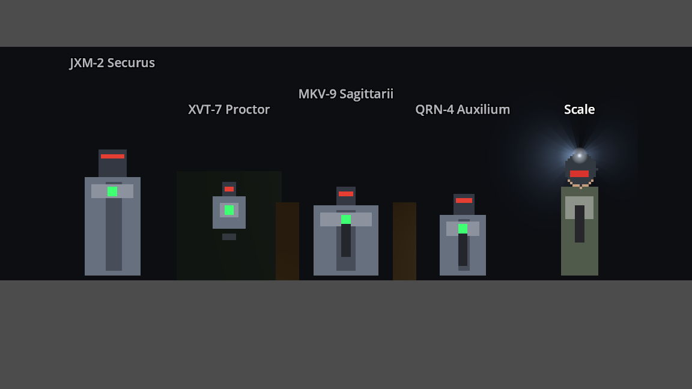

# Retake the Spaceship

A turn-based, squad-level tactics game aboard derelict spaceships — XCOM's grid logic and a
*Dead Space* tone, built in Godot 4.

**Presentation: isometric.** Levels are real 3D geometry seen through a fixed orthographic
isometric camera, and characters are rigged 3D models animated in engine inside that world.
The project went through a prerendered-sprite phase — characters rendered offline from the
same rigs into eight-facing PNG sheets, Fallout-style — and came back to real models because
a flat card cannot know how far in front of its root a planted boot is, so feet floated or
sank depending on facing. A mesh stands on the floor by construction. The fixed camera stayed.
[`docs/presentation-direction.md`](docs/presentation-direction.md) is the source of truth for
the camera and how levels are drawn; its character sections still describe the sprite era.
The sections of the GDD it replaces are marked SUPERSEDED in place and point at it.

| | |
|---|---|
| Camera | Orthographic, pitch fixed at 35.264°, four snapped yaws (Q/E), no zoom |
| Characters | Rigged 3D models exported from Blender, animated in engine, lit by the scene |
| Movement | Eight-way at uniform cost, guarded against cutting the corner where two walls meet |
| Levels | 3D geometry built at runtime from ASCII decks in [`maps/`](maps/) |
| Turn order | One shared initiative pool — friend and foe drawn from the same weighted bag |
| Signature systems | Continuous light/sound detection; edge-based XCOM cover; VATS-style Aimed Shot |

## What is in the game today

- **Contractors** — the player squad. Four classes, five weapons chosen on a pre-mission
  loadout screen, 2 AP per activation, injuries rather than permadeath.
- **Aliens** — the infestation. Light-and-sound detection, local alert propagation, a melee
  swarm and a ranged type.
- **Security robots** — *Cerberus Applied Sciences*, the ship's own lockdown-mode security
  net, and the second faction. Sensor-driven rather than light-driven, alerted zone-wide over
  a network, armored, and destroyed rather than injured. Alpha implementation of all four
  roster models is in and playable; see
  [`docs/design/factions/security-robots/`](docs/design/factions/security-robots/).

The two enemy factions are deliberately different *problems* rather than different stat
blocks: aliens are a lighting puzzle, robots are a positioning-and-EMP puzzle. Killing the
lights is the answer to one and buys nothing against the other.



## The character art pipeline

Characters are rigged and animated in Blender, then exported to
`assets/models/<variant>.glb` by `tools/export_models.py`. The export renames every action to
the game pose it plays (`idle`, `run`, `throw_grenade`, …), so `UnitVisual` asks for a pose by
intent and never has to know what the .blend called it. A sidecar `<variant>.json` beside each
.glb carries what the .glb cannot: the list of poses exported and any per-pose yaw correction.

```sh
# One character, from the .blend it is animated in.
blender -b art_src/merc_anim.blend -P tools/export_models.py -- --variant merc

# Everything, each from its own .blend (spawns one Blender per variant).
blender -b -P tools/export_models.py -- --all
```

The export also applies a game budget in memory on the way out — decimation and a texture
size cap per variant (`BUDGET` in `export_models.py`) — so the source .blends never have to be
edited down.

A character with no .glb still plays: `UnitVisual` builds a readable placeholder from
primitive meshes, and every action resolves on a timer the length the real animation takes,
so action *pacing* is identical whether or not the art exists.

**The worm piles are layouts, not models.** Their .blends are generated from the single worm —
its armature instanced into a heap with every copy's action phase-shifted, so the pile writhes
instead of pulsing as one drawing — and the export writes a `.json` of instance transforms and
phase offsets that the game builds from `worm.glb`:

```sh
# Build art_src/worm_pile_{clutch,knot,tide}.blend from art_src/worm_anims.blend.
blender -b art_src/worm_anims.blend -P tools/build_worm_piles.py

# Export one pile's layout.
blender -b art_src/worm_pile_tide.blend -P tools/export_models.py -- --variant worm_tide
```

Re-run the build after any change to the worm itself — the piles are copies of it and will not
pick the change up otherwise. `tools/build_worm_piles.py` seeds its own RNG, so rebuilding
reproduces the same heap rather than reshuffling art that has already been judged on screen.

**The muzzle flash comes from `assets/gun_vfx.blend`.** Its look is two procedural node
materials, which glTF cannot carry, so `tools/bake_muzzle_flash.py` bakes each to an RGBA
texture and exports the mesh with them to `assets/vfx/muzzle_flash.glb`:

    blender.exe -b assets/gun_vfx.blend -P tools/bake_muzzle_flash.py

`MuzzleFlash` (`scripts/muzzle_flash.gd`) draws those textures unshaded and additive, and
`UnitVisual` mounts one on the rifle at the merc model's `muzzle_flash` node. That node is
the old flash mesh, now hidden and kept only as the barrel-tip marker the flash and the rig
light hang from. Re-run the bake after editing the flash in Blender.

**`tools/render_sprites.py` is still load-bearing**, though nothing renders sprites any more:
`export_models.py` imports its pose tables (`POSES`, `POSE_ACTION`) and the rest-yaw constants
(`BUCKET_ZERO_DEGREES`, `VARIANT_BUCKET_ZERO`, `POSE_BUCKET_ZERO`) rather than restating them.
A wrong rest yaw is invisible in Blender — the character looks fine, and only a unit walking
east while facing north-east gives it away in game — so it lives in exactly one place.

`tools/test_unit_models.gd` pins the contract between the export and the game: the poses each
character is played through exist in its .glb, and the pile layouts hold the worm counts
`WormUnit`'s tiers are drawn at.

For judging art in the real camera, `tools/preview_sprite.gd` screenshots one unit scene under
the game's exact iso rig, and `tools/anim_gym.gd` (windowed) plays its animations on a loop.

## Running it

Godot 4.7. Open the project and press play, or:

```sh
godot --path .                     # play
godot --headless --path . -- --auto  # headless smoke test: a full skirmish, no input
```

### Checks

All but the last run headless. There is no test framework — each is a `--script` tool that
prints PASS/FAIL lines and exits non-zero on failure.

```sh
godot --headless --path . --script res://tools/test_map_roundtrip.gd   # map format, spawns, room graph
godot --headless --path . --script res://tools/test_edge_cover.gd      # cover direction, diagonals, degradation
godot --headless --path . --script res://tools/test_movement.gd        # 8-way adjacency, diagonal cost, corner guard
godot --headless --path . --script res://tools/test_sprite_direction.gd # eight-way direction buckets
godot --headless --path . --script res://tools/test_unit_models.gd      # exported .glb poses, worm pile layouts
godot --headless --path . --script res://tools/test_iso_picking.gd     # mouse picking at all four yaws
godot --headless --path . --script res://tools/test_cerberus.gd        # security-robot faction rules
godot --path . --script res://tools/test_room_visibility.gd            # render gating (needs a window)
```

## Documentation

| Doc | What it is |
|---|---|
| [`game-design-document.md`](game-design-document.md) | The full GDD. Source of truth for system *rules*. |
| [`docs/presentation-direction.md`](docs/presentation-direction.md) | Source of truth for how the game is **drawn**. Supersedes the GDD's camera and rendering sections. |
| [`docs/design/`](docs/design/) | The GDD reorganised and expanded **per faction** — who they are, what they field, and why. |
| [`MIGRATION_PLAN.md`](MIGRATION_PLAN.md) | The 3D → isometric migration: what changed, why, and the two phases still outstanding. |
| [`MIGRATION_PLAN_3D_8DIR.md`](MIGRATION_PLAN_3D_8DIR.md) | A proposed reversal of that migration, **overtaken by events** — kept because it is the record of how eight-way movement arrived without the runtime 3D pipeline coming back with it. |
| [`character-art-plan.md`](character-art-plan.md) | Contractor art direction — the modelling and animation brief the models are made against. |
| [`weapon-art-plan.md`](weapon-art-plan.md) | Weapon art direction. The shape language and the Blender-side tooling are live, since weapons are modelled and rendered with the character; its Godot-side sections describe the deleted runtime `.glb` and do not. Its banner still says the whole thing is dead, which is a correction behind `character-art-plan.md`'s. |

## Still outstanding

**Character art.** Four characters have models — the merc (the contractors), the brawler, the
worm (and its three piles) and the nest. The merc has 21 poses, including cover variants; the
others have what their behaviour needs (`idle`, `walk`/`run`, `melee`). In priority order:

- `aim_hold` — the one firing pose the merc lacks, and the one held longest on screen, since a
  unit sits in it for the whole of an Aimed Shot. Until then it falls back to idle.
- The rest of the merc's vocabulary — `walk`, `run_stop`, `melee`, `alert_scream` and
  `idle_fidget`.
- The swarm, the ranged alien and the four Cerberus models have no model at all and run on
  `UnitVisual`'s primitive placeholder, which is what the lineup image above is showing.

**Map art**, both gated on geometry that does not exist yet, with standing task lists in
`MIGRATION_PLAN.md`:

- **Authored `.glb` map modules** (Phase 8). Every wall is still a runtime `BoxMesh`.
- **Baked lighting** (Phase 7b), which needs that geometry to exist at bake time.
